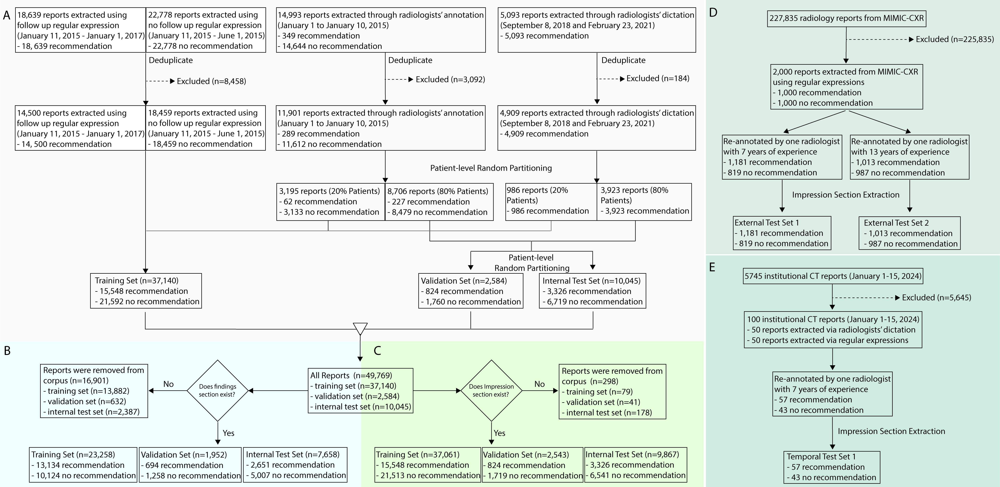

# Large-scale evaluation of machine learning models in identifying follow-up recommendations in radiology reports

This is the official code repository for the manuscript "Large-scale evaluation of machine learning models in identifying follow-up recommendations in radiology reports".

**Study flowchart.** Figure 1. Study flowchart. (A) Three sets of radiology reports were gathered: the first one extracted through two regular expressions—sequences of characters that define search patterns in text (Section S1), the second was annotated during dictation, while the third was annotated by three radiologists. All three datasets underwent deduplication to remove duplicate reports. The training set was created by combining the dataset extracted using regular expressions with reports from 20% of patients randomly selected from the two manually annotated datasets, ensuring that each patient was assigned to only one split. The remaining reports from 80% of patients in the radiologist-annotated datasets were divided into validation and internal test sets with a ratio of 1:4, maintaining patient-level separation. (B) Reports lacking a finding section from the training, validation, and internal test sets were excluded from the analysis, as this section was missing. (C) Any reports from the training, validation, and internal test sets that did not include an impression section were eliminated from consideration. (D) The impression sections of 2,000 MIMIC-CXR reports were collected as an external test set. (E) The impression sections 100 CT institutional reports were gathered at a different time point using newer data to serve as a temporal test set.